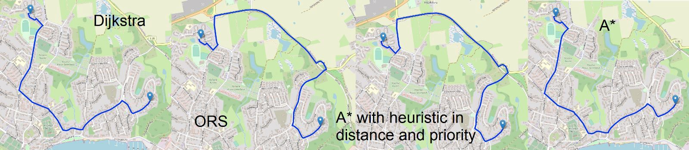

# Shortest_PathGraph
This system calculates and displays the shortest path between two points on a map using different methods.

# How to run
-Build Backend (Originally built in IntelliJ IDEA Community Edition 2022.2.3)
-Run both Main and TCP Server
-In Terminal, navigate to UI folder. Run: npm install AND npm run develop
-Select 2 points in the zone of Eckernförde (That´s where the json file´s Graph is), choose any of the 3 external API options, or one of the 2, internal algorithms

### Components: 

- #### User Interface (UI):
  Allows the user to specify the starting and ending points for the path calculation. Displays the calculated route.

- ##### TCP Server:
  Listens for multiple requests from the UI. Communicates with the chosen pathfinding service or algorithm. Sends the calculated path back to the UI.

- #### Pathfinding Module:
  Can either call an external API or use an internal algorithm to calculate the shortest path.

### Pathfinding Methods.

The system offers three options to find the shortest path:

- #### Via a API,
  which receives the information about both points on the map, for which the shortest path is to be known, and which returns the path.

- #### Via either the Dijkstra or the A Star algorithms:
  Algorithm idea: From the point of start, nodes to which one could move are added to and ordered, in a priority queue, along with the cost from the origin to reach them. The algorithm will always decide to make movements to the one node, which cost is lowest. In subsequent steps, similarly, it is looked into nodes which could be reached. Nodes not previously on the priority queue are added to it, and nodes already on the priority queue, for which new paths towards them, and which are cheaper in cost, are found, are updated in cost in the priority queue. The process is continued until either: the end node is found, or, there are no longer additional nodes in the priority queue, and therefore no way of reaching the second from the first node. The A Star algorithm works in a similar manner, with the addition that distances are calculated as the sum of the cost from origin to the currently considered node, plus an approximated cost of getting from the reaching node to the final target one, with sights to guide the algorithm to favour decisions which get it more efficiently to the objective. 

## Results

